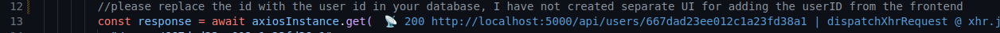

# Opika React Frontend Application

Welcome to the React frontend application for viewing user profiles. This application interacts with a backend Node.js API on user data.

## Table of Contents

- [Prerequisites](#prerequisites)
- [Configuration](#configuration)
- [Getting Started](#getting-started)
  - [Installation](#installation)

## Replace the user id with the actual user id from the DB, in App.tsx file, if you don't replace it you'll get this warning "please replace the id with the user id in your database, I have not created separate UI for adding the userID from the frontend"



## Prerequisites

Before running the application, ensure you have the following installed:

- Node.js (v14.x or higher)
- npm (Node Package Manager)
- A compatible web browser (Chrome, Firefox, Safari, Edge)

## Configuration

Create a .env file in the root directory:

    REACT_APP_API_BASE_URL="https://localhost:5000/api"

## Getting Started

Follow these steps to get the frontend application up and running on your local machine.

### Installation

1. Clone the repository:

   ```bash
   git clone <repository-url>
   ```

2. Install dependencies:

   ```bash
   npm install
   ```

3. Running the application:

   ```bash
   npm start
   ```
